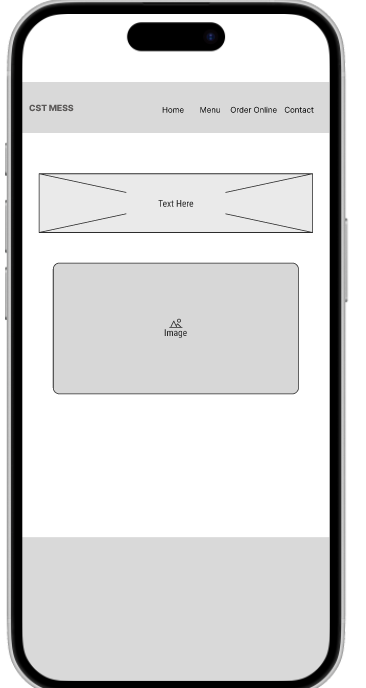
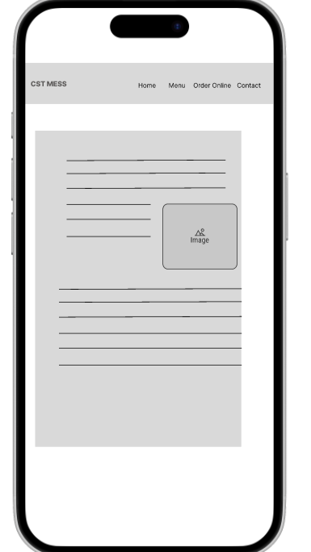
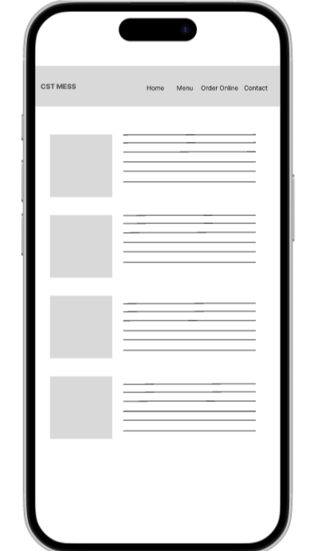
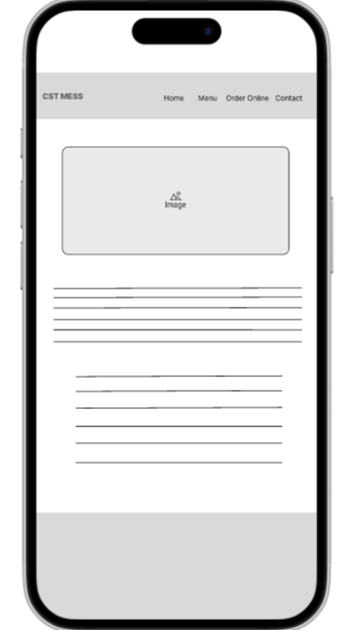
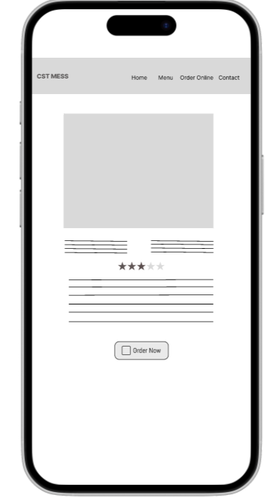
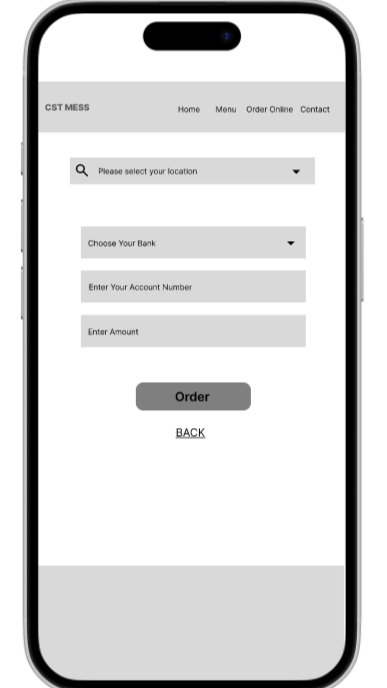
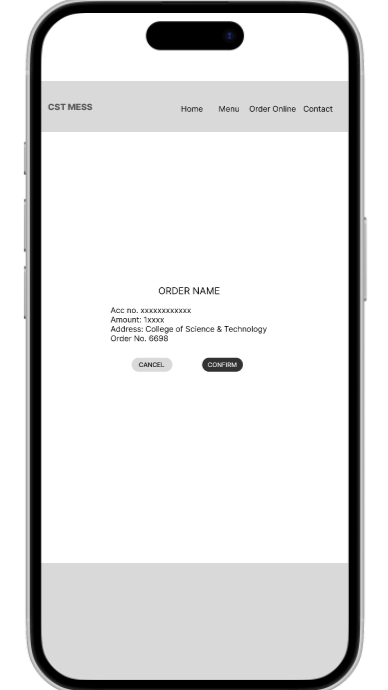
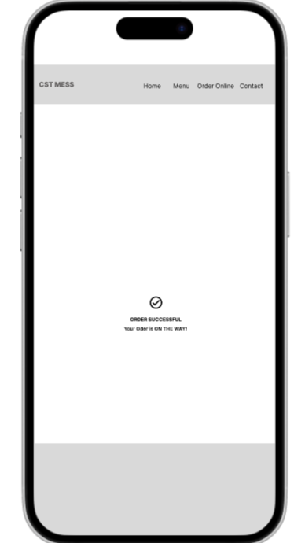

# Wireframe

## Exercise: Create a wireframe for a food website. Focus on the user experience and layout, ensuring that the design is intuitive and easy to navigate.

### Figma Link: 
https://www.figma.com/design/qjZWdPoc8TYbNYmLvXprg4/Wireframe?m=auto&t=Xm2zZnQXwN2lmmLl-6

### Wireframe images:

 
 
 
 
 
 
 
 